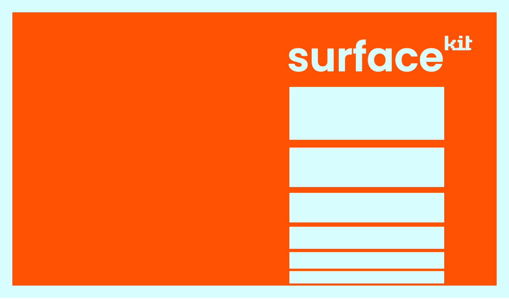

<div style="margin-bottom: 30px"></div>

# SurfaceKit  ▉▊▋▍▎▏

> Lightning-fast, seamless UI creation for React and React Native.

### ✨ Why SurfaceKit?

- **🚀 Zero Config Magic** - Use it as is or start customzing your own theme, it just works 🪄
- **🎯 Straight to the Point** - Stay in the flow by updating style inline. 
- **🔧 Type-Safe** - TypeScript support out of the box
- **📦 Overrides-Based** - Clear path to override style based on hover, focus, focus-within
- **🌐 Fully Compatible with Reanimated 4** - It automatically uses Reanimated components when needed.

## 📦 Installation

```bash
npm install surfacekit
# or
yarn add surfacekit
# or
pnpm add surfacekit
```

## 🛠️ Get Started

// TODO


---

<div align="center">
  <p>Remember:</p>
  <p>⭐ Star us on GitHub if you enjoy using it!</p>
</div>
