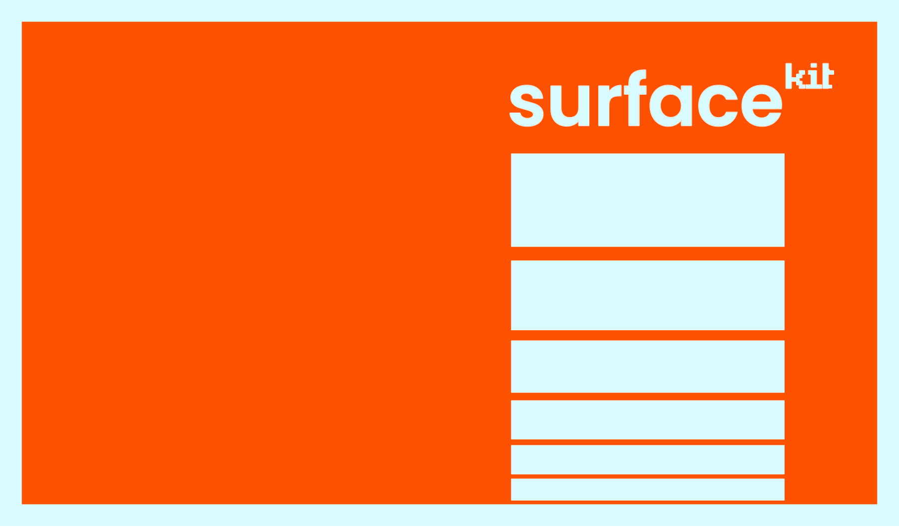

<div align="center">
  
  <br />
  <br />
</div>

# SurfaceKit ▉▊▋▍▎▏

> **Lightning-fast, type-safe surface primitives for React and React Native.**  
> Build polymorphic components with declarative variants and runtime style overrides. Stop wrestling with style objects. Start building beautiful UIs with confidence.

[](https://www.npmjs.com/package/surfacekit)
[](https://opensource.org/licenses/MIT)

---

## 🎯 What is SurfaceKit?

SurfaceKit is your **design system's best friend**. It transforms design tokens into production-ready components without the boilerplate headache. Think of it as **styled-components meets Tailwind meets Framer Motion**—but actually fun to use.

SurfaceKit empowers you to build **polymorphic components** that adapt their underlying DOM/RN element through the `as` prop, while maintaining full type safety across variant props and style overrides. The variant system enables **composable style APIs** where each variant defines a discrete set of style mutations, and **runtime overrides** let you inject dynamic styles based on interaction state, props, or computed values—all without sacrificing type inference or performance.

### Why developers love SurfaceKit ✨

- 🚀 **Zero boilerplate** – Move from tokens to components in seconds
- 🎨 **Type-safe variants** – Compose polymorphic style APIs without juggling style objects
- 🎭 **Declarative overrides** – Runtime style injection for hover, press, focus, and presence states
- ⚡ **Performance first** – Built on Reanimated, gesture-handler, and Expo fonts
- 🔧 **Your theme, your rules** – Bring any theme shape; SurfaceKit infers the rest

---

## 📚 Table of Contents

**Getting Started**
- [Installation](#-installation)
- [Quick Start](#-quick-start-guide)

**Core Concepts**
- [Setting Up Your Theme](#-setting-up-your-theme)
- [Creating Surfaces](#-creating-surfaces)
- [Variants Explained](#-variants-explained)
- [Dynamic Variants](#-dynamic-variants-with-attrsany)

**Common Tasks** 🎯 *Quick answers to "How do I...?"*
- [How do I create a button with variants?](#-how-do-i-create-a-button-with-variants)
- [How do I add hover/press states?](#-how-do-i-add-hoverpress-states)
- [How do I animate layout changes?](#-how-do-i-animate-layout-changes)
- [How do I use gestures?](#-how-do-i-use-gestures)
- [How do I compose components?](#-how-do-i-compose-components)

**Advanced Features**
- [Animations & Transitions](#-animations--transitions)
- [Interaction States](#-interaction-states)
- [Hooks & Utilities](#-hooks--utilities)
- [Base Components](#-base-components)

**Reference**
- [API Reference](#-api-reference)
- [Testing](#-testing)

---

## 📦 Installation

```bash
npm install surfacekit
# or
yarn add surfacekit
# or
pnpm add surfacekit
```

**Peer dependencies** (optional but recommended):
- `react-native-reanimated` – For animations
- `react-native-gesture-handler` – For gestures
- `expo-font` – For font management

SurfaceKit works with React Native, Expo, and universal (web) projects.

---

## 🚀 Quick Start Guide

**3 steps to your first surface:**

### Step 1: Define your theme

```tsx
// theme.ts
export const theme = {
  colors: {
    primary: '#3b82f6',
    gray: { 50: '#f9fafb', 100: '#f3f4f6', /* ... */ },
  },
  spacing: {
    space1: 4,
    space2: 8,
    space4: 16,
    space6: 24,
    // ... your spacing scale
  },
  borderRadius: {
    sm: 4,
    md: 8,
    lg: 12,
    full: 9999,
  },
  fonts: {
    paragraph: {
      default: require('./assets/Inter-Regular.ttf'),
      medium: require('./assets/Inter-Medium.ttf'),
    },
  },
};
```

### Step 2: Create your surfaced instance

```tsx
// surfaced.ts
import { createSurfaced } from 'surfacekit';
import type { theme } from './theme';

type AppTheme = typeof theme;
export const surfaced = createSurfaced<AppTheme>();
```

### Step 3: Build your first component

```tsx
// App.tsx
import { View, Text } from 'react-native';
import { surfaced } from './surfaced';
import { theme } from './theme';

const Card = surfaced(View).with(({ theme, attrs }) => ({
  padding: theme.spacing.space6,
  backgroundColor: theme.colors.gray[900],
  borderRadius: theme.borderRadius.lg,
  variants: {
    tone: {
      primary: { backgroundColor: theme.colors.primary },
      neutral: { backgroundColor: theme.colors.gray[800] },
    },
    elevation: attrs.any({ 
      attribute: 'elevation', 
      number: true 
    }),
  },
}));

export default function App() {
  return (
    <surfaced.Provider theme={theme}>
      <Card tone="primary" elevation={4}>
        <Text>Hello SurfaceKit! 🎉</Text>
      </Card>
    </surfaced.Provider>
  );
}
```

**That's it!** You're now building with SurfaceKit. 🎊

---

## 🎨 Setting Up Your Theme

Your theme can be **any nested object structure**. SurfaceKit preserves full type information, so you can use dot-separated paths like `colors.gray.500` or `fonts.paragraph.medium` with full autocomplete.

```tsx
const theme = {
  // Flat structure? ✅
  primaryColor: '#3b82f6',
  
  // Nested? ✅
  colors: {
    brand: {
      primary: '#3b82f6',
      secondary: '#8b5cf6',
    },
  },
  
  // Deep nesting? ✅
  typography: {
    headings: {
      h1: { fontSize: 32, fontWeight: 'bold' },
      h2: { fontSize: 24, fontWeight: '600' },
    },
  },
};
```

**The only requirement:** Your theme must include a `fonts` object if you plan to use font tokens.

---

## 🏗️ Creating Surfaces

Surfaces are **polymorphic components** created with `surfaced(Component).with(factory)`. The factory function receives:

- `theme` – Your entire theme object (fully typed!)
- `attrs` – Helpers for creating dynamic variants and computed style transformations

Surfaces support **polymorphism** via the `as` prop, allowing you to swap the underlying component while preserving all variant props and style behavior. This enables true component composition where a `Button` surface can render as a `View`, `Text`, or any custom component without losing its variant API.

```tsx
const Button = surfaced(View).with(({ theme, attrs }) => ({
  // Base styles (always applied)
  paddingHorizontal: theme.spacing.space4,
  paddingVertical: theme.spacing.space2,
  borderRadius: theme.borderRadius.md,
  
  // Variants (controlled via props)
  variants: {
    size: {
      small: { paddingHorizontal: theme.spacing.space2 },
      large: { paddingHorizontal: theme.spacing.space6 },
    },
    variant: {
      primary: { backgroundColor: theme.colors.primary },
      secondary: { backgroundColor: theme.colors.gray[200] },
    },
  },
}));

// Usage
<Button size="large" variant="primary">Click me</Button>
```

---

## 🎭 Variants Explained

Variants are the heart of SurfaceKit's **composable style system**. They let you expose new props that control styles without leaking implementation details. Each variant defines a **discrete style mutation** that can be combined with other variants, creating a type-safe API surface that abstracts away style object complexity. Variants support **polymorphic composition**—you can extend surfaces and override specific variant definitions while inheriting the rest.

### Boolean Variants

Perfect for on/off states:

```tsx
const Badge = surfaced(View).with(({ theme }) => ({
  variants: {
    pill: {
      true: { borderRadius: theme.borderRadius.full },
    },
    outlined: {
      true: { borderWidth: 1 },
    },
  },
}));

<Badge pill outlined />  // Both variants active
```

**Pro tip:** Use `attrs.boolean()` for a shortcut:

```tsx
variants: {
  pill: attrs.boolean({ borderRadius: theme.borderRadius.full }),
}
```

### String/Enum Variants

For multiple options:

```tsx
const Alert = surfaced(View).with(({ theme }) => ({
  variants: {
    status: {
      success: { backgroundColor: theme.colors.green[100] },
      error: { backgroundColor: theme.colors.red[100] },
      warning: { backgroundColor: theme.colors.yellow[100] },
    },
  },
}));

<Alert status="success">All good!</Alert>
```

### Variant Order Matters

When multiple variants affect the same property, **the last prop wins**:

```tsx
<Button variant="primary" variant="secondary" />
// Result: secondary wins (applied last)
```

---

## ⚡ Dynamic Variants With `attrs.any`

`attrs.any()` is your Swiss Army knife for creating flexible variants. It turns a config object into a type-safe variant.

### Common Patterns

**Token-based values:**
```tsx
const Spacer = surfaced(View).with(({ theme, attrs }) => ({
  variants: {
    gap: attrs.any({ 
      attribute: 'gap', 
      tokens: theme.spacing,  // Maps "space4" → theme.spacing.space4
      number: true,            // Also accepts numbers
    }),
  },
}));

<Spacer gap="space8" />  // Token lookup
<Spacer gap={32} />      // Direct number
```

**Computed styles:**
```tsx
const Container = surfaced(View).with(({ theme, attrs }) => ({
  variants: {
    size: attrs.any({
      tokens: theme.spacing,
      compute: (value) => ({ 
        padding: value / 2,
        margin: value,
      }),
    }),
  },
}));

<Container size={24} />  // padding: 12, margin: 24
```

**Transform accumulation:**
```tsx
const Rotatable = surfaced(View).with(({ attrs }) => ({
  variants: {
    rotate: attrs.any({ 
      accumulate: 'transform',
      attribute: 'rotate', 
      number: true, 
      angle: true,
    }),
  },
}));

<Rotatable rotate={45} />  // Adds to transform array
```

### `attrs.any` Options Reference

| Option | Purpose | Example |
|-------|---------|---------|
| `attribute` / `attributes` | Target style key(s) | `attribute: 'gap'` or `attributes: ['margin', 'padding']` |
| `tokens` | Map strings to token paths | `tokens: theme.spacing` |
| `number`, `percentage`, `string`, `angle`, `color`, `time` | Enable value types | `number: true` |
| `multiple` | Accept arrays | `multiple: true` → `gap={[4, 8]}` |
| `accumulate` | Group into arrays (for transforms) | `accumulate: 'transform'` |
| `fonts` | Register fonts with Expo Font | `fonts: true` |
| `compute` | Dynamic style computation | `compute: (val) => ({ padding: val / 2 })` |
| `custom` | Full control over style application | `custom: (style, config) => {...}` |

---

## 🎯 Common Tasks

### How do I create a button with variants?

```tsx
const Button = surfaced(View).with(({ theme, attrs }) => ({
  paddingHorizontal: theme.spacing.space4,
  paddingVertical: theme.spacing.space2,
  borderRadius: theme.borderRadius.md,
  variants: {
    size: {
      small: { paddingHorizontal: theme.spacing.space2 },
      large: { paddingHorizontal: theme.spacing.space6 },
    },
    variant: {
      primary: { backgroundColor: theme.colors.primary },
      secondary: { backgroundColor: theme.colors.gray[200] },
    },
    disabled: attrs.boolean({ opacity: 0.5 }),
  },
}));

<Button size="large" variant="primary" disabled>
  Submit
</Button>
```

### How do I add hover/press states?

Use the `overrides` prop with `stateId`:

```tsx
<Button
  stateId="submit-button"
  overrides={(state) => [
    state.hovered && { backgroundColor: theme.colors.primaryDark },
    state.pressed && { transform: [{ scale: 0.95 }] },
    state.focused && { borderWidth: 2 },
  ]}
>
  Click me
</Button>
```

**Available states:**
- `state.hovered` – Mouse/touch hover
- `state.pressed` – Active press
- `state.focused` – Keyboard focus
- `state.exiting` – Component is unmounting (with `transition={{ children: true }}`)

### How do I animate layout changes?

Use `transition` prop:

```tsx
// Animate height/width changes
<View
  transition={{ height: true, width: true }}
>
  {content}
</View>

// Animate position changes (reordering)
<View
  transition={{ position: true }}
>
  {items.map(item => <Item key={item.id} />)}
</View>

// Animate children enter/exit
<View transition={{ children: true }}>
  {items.map(item => (
    <View
      key={item.id}
      overrides={(state) => [
        state.exiting && { opacity: 0, detach: true },
      ]}
    />
  ))}
</View>
```

**Important:** Size transitions only work when `height`/`width` props are **not** explicitly set. SurfaceKit measures content automatically.

### How do I use gestures?

Pass gestures from `react-native-gesture-handler`:

```tsx
import { Gesture } from 'react-native-gesture-handler';

<Surface
  stateId="draggable"
  gesture={Gesture.Pan()
    .onUpdate((e) => {
      // Handle drag
    })
  }
  overrides={(state) => [
    state.pressed && { opacity: 0.8 },
  ]}
/>
```

SurfaceKit automatically composes gestures declared in `overrides`.

### How do I compose components?

SurfaceKit supports **polymorphic composition** through surface extension. Extend existing surfaces:

```tsx
const BaseCard = surfaced(View).with(() => ({
  padding: 16,
  borderRadius: 8,
  variants: {
    elevation: {
      low: { elevation: 2 },
      high: { elevation: 8 },
    },
  },
}));

const FancyCard = surfaced(BaseCard).with(() => ({
  // Inherits all BaseCard styles and variants
  shadowColor: '#000',
  variants: {
    elevation: {
      // Overrides BaseCard's elevation variant
      high: { elevation: 12 },
    },
    glow: {
      true: { shadowOpacity: 0.5 },
    },
  },
}));

<FancyCard elevation="high" glow />
```

Use `.as()` for **polymorphic rendering**—swap the underlying component while preserving all variants and overrides:

```tsx
const Button = surfaced(View).with(/* ... */);
const LinkButton = Button.as(Text);  // Renders as <Text> but keeps Button's variant API
```

This enables true **polymorphism**: the same component interface can render different underlying elements based on context, while maintaining consistent styling behavior.

---

## 🎬 Animations & Transitions

SurfaceKit integrates seamlessly with Reanimated 3/4.

### Layout Size Transitions

Animate containers that resize based on content:

```tsx
<View
  transition={{ height: true, width: true }}
>
  {items.map(item => (
    <View key={item.id} height={50} />
  ))}
</View>
```

**Note:** Don't set explicit `height`/`width` props on the container. SurfaceKit measures automatically.

### Layout Position Transitions

Animate elements moving within their parent:

```tsx
<View display="flex" flexDirection="row" gap={10}>
  {items.map((item) => (
    <View
      key={item}
      width={50}
      height={50}
      transition={{ position: true }}
    >
      <Text>{item}</Text>
    </View>
  ))}
</View>
```

Perfect for reordering lists or moving elements between containers.

### Children Transitions

Enable enter/exit animations for dynamically added/removed children:

```tsx
<View transition={{ children: true }}>
  {items.map((item) => (
    <View
      key={item.id}
      transition={{ opacity: true }}
      overrides={(state) => [
        state.exiting && { 
          opacity: 0, 
          detach: true,  // Removes from layout after animation
        },
      ]}
    >
      {item.content}
    </View>
  ))}
</View>
```

**Key features:**
- `state.exiting` – `true` when child is being removed
- `detach: true` – Removes element from layout flow after animation
- Works seamlessly with size transitions

### Combining Transitions

Mix and match for complex animations:

```tsx
<View
  transition={{ 
    height: true,      // Container height
    width: true,       // Container width
    children: true,    // Enter/exit animations
  }}
>
  {items.map((item) => (
    <View
      key={item.id}
      transition={{ 
        position: true,  // Position when reordered
        opacity: true,   // Fade in/out
      }}
      overrides={(state) => [
        state.exiting && { opacity: 0, detach: true },
      ]}
    >
      {item}
    </View>
  ))}
</View>
```

### Reanimated Animations

Use Reanimated's animation builders:

```tsx
import { FadeIn, FadeOut } from 'react-native-reanimated';

<Surface
  entering={FadeIn.duration(300)}
  exiting={FadeOut.duration(200)}
>
  Content
</Surface>
```

### Keyframe Animations

```tsx
<Surface
  animation={{
    keyframes: {
      opacity: [0, 1, 0],
      transform: [{ scale: [0.8, 1.2, 1] }],
    },
    duration: 1000,
  }}
>
  Animated content
</Surface>
```

---

## 🎮 Interaction States

### Using `stateId` and `overrides`

SurfaceKit's **override system** enables runtime style injection based on component state. Opt into interaction tracking with `stateId`, then use the `overrides` prop to declaratively define style mutations that respond to interaction state. Overrides are **composable and mergeable**—multiple override functions can be applied, and they merge with variant styles in a predictable order (variants → overrides → style prop).

```tsx
<Button
  stateId="cta-button"
  overrides={(state) => [
    state.hovered && { backgroundColor: theme.colors.primaryDark },
    state.pressed && { transform: [{ scale: 0.95 }] },
    state.focused && { borderWidth: 2, borderColor: theme.colors.primary },
  ]}
>
  Click me
</Button>
```

### Reading State in Children

Use `Interaction.Inline` to consume state in child components:

```tsx
import { Interaction } from 'surfacekit';

<Surface stateId="card">
  <Interaction.Inline stateId="card">
    {(state) => (
      state.hovered ? <Tooltip>Hovering!</Tooltip> : null
    )}
  </Interaction.Inline>
</Surface>
```

**Available states:**
- `hovered` – Mouse/touch hover active
- `pressed` – Press gesture active
- `focused` – Keyboard focus active
- `exiting` – Component unmounting (requires `transition={{ children: true }}`)

---

## 🛠️ Hooks & Utilities

SurfaceKit provides helpful hooks for common tasks:

### `surfaced.useTheme()`

Access the current theme:

```tsx
const MyComponent = () => {
  const theme = surfaced.useTheme();
  return <View backgroundColor={theme.colors.primary} />;
};
```

### `surfaced.useFonts()`

Register font tokens and know when they're ready:

```tsx
const App = () => {
  const { loaded, error } = surfaced.useFonts();
  
  if (!loaded) return <LoadingScreen />;
  if (error) return <ErrorScreen error={error} />;
  
  return <YourApp />;
};
```

### `surfaced.useOrientation()`

Observe device orientation:

```tsx
const MyComponent = () => {
  const orientation = surfaced.useOrientation();
  
  return (
    <View flexDirection={orientation === 'landscape' ? 'row' : 'column'}>
      Content
    </View>
  );
};
```

### `surfaced.useMediaQuery(query)`

Evaluate responsive breakpoints:

```tsx
const MyComponent = () => {
  const isMobile = surfaced.useMediaQuery('(max-width: 768px)');
  
  return (
    <View padding={isMobile ? 16 : 32}>
      Content
    </View>
  );
};
```

### `surfaced.useVariantStyle(Component, variant, value)`

Compute variant styles outside render:

```tsx
const MyComponent = () => {
  const style = surfaced.useVariantStyle(Button, 'variant', 'primary');
  // Use style for calculations, etc.
};
```

---

## 🧱 Base Components

SurfaceKit ships with opinionated base components you can use or reference:

### `createViewBase(surfaced)`

A fully-featured View surface with layout, spacing, transform, and background variants:

```tsx
import { createViewBase } from 'surfacekit';

const View = createViewBase(surfaced);

// Now you have all these variants:
<View 
  display="flex"
  flexDirection="row"
  gap="space4"
  padding="space6"
  backgroundColor="gray.900"
  borderRadius="lg"
  rotate={45}
/>
```

### `createTextBase(surfaced)`

Typography-focused surface with font, color, and decoration variants:

```tsx
import { createTextBase } from 'surfacekit';

const Text = createTextBase(surfaced);

<Text 
  fontSize="lg"
  fontWeight="bold"
  color="primary"
  textDecoration="underline"
>
  Styled text
</Text>
```

**Tip:** Check the test suite (`tests/charm.test.tsx`) to see all available variants.

---

## 📖 API Reference

### `createSurfaced<Theme>()`

Creates a surfaced instance bound to your theme type.

**Returns:**
- `surfaced(Component).with(factory)` – Create surfaces
- `surfaced.Provider` – Theme provider component
- `surfaced.useTheme()` – Hook to access theme
- `surfaced.useFonts()` – Hook to manage fonts
- `surfaced.useOrientation()` – Hook for orientation
- `surfaced.useMediaQuery(query)` – Hook for media queries
- `surfaced.useVariantStyle(Component, variant, value)` – Compute variant styles

### `surfaced(Component).with(factory)`

Creates a **polymorphic surface component** with a type-safe variant API. The resulting component can be rendered with different underlying elements via the `as` prop while maintaining all variant props and style behavior.

**Factory signature:**
```tsx
({ theme, attrs }) => ({
  // Base styles
  padding: theme.spacing.space4,
  
  // Variants
  variants: {
    size: { small: {...}, large: {...} },
  },
  
  // Dynamic styles (optional)
  dynamic: (props) => ({ opacity: props.disabled ? 0.5 : 1 }),
  
  // Transitions (optional)
  transition: { opacity: true },
  
  // Animation config (optional)
  animation: { keyframes: {...}, duration: 1000 },
})
```

### Surface Props

All surfaces accept:

- **Variant props** – Any keys defined in `variants` (type-safe, composable style mutations)
- **`as`** – **Polymorphic rendering**: swap underlying component: `as={Text}` while preserving variant API
- **`gesture`** – Gesture handler gesture
- **`transition`** – Transition config: `{ height: true, position: true, children: true }`
- **`animation`** – Keyframe animation config
- **`entering`** / **`exiting`** – Reanimated animation builders
- **`stateId`** – Enable interaction state tracking for runtime overrides
- **`overrides`** – **Runtime style injection**: function returning override styles: `(state) => [...]` (merged after variants, before style prop)
- **`style`** – Standard React Native style prop (merged last, highest precedence)

**Style resolution order:** Base styles → Variants → Overrides → `style` prop

### Token Lookups

SurfaceKit supports nested token paths:

```tsx
// These all work:
<View backgroundColor="colors.primary" />
<View backgroundColor="colors.brand.primary" />
<View padding="spacing.space4" />
<View fontFamily="fonts.paragraph.medium" />
```

**Negative values:** Prepend `-` to flip numeric tokens:
```tsx
<View marginLeft="-space4" />  // -theme.spacing.space4
```

**Falsy values:** SurfaceKit preserves `0` and `false` values:
```tsx
<View gap="space0" />  // Stays 0, not dropped
```

---

## 🧪 Testing

The test suite demonstrates every capability in context. Start with:

```bash
npm test
```

**Key test files:**
- `tests/charm.test.tsx` – Variants, tokens, overrides, composition
- `tests/animated.test.tsx` – Animation and transition examples
- `tests/gesture.test.tsx` – Gesture integration
- `tests/overrides.test.tsx` – Interaction state handling

---

## 🤝 Contributing

Found a bug? Have an idea? We'd love your help!

1. Open an issue describing the problem or feature
2. Fork the repo and create a branch
3. Make your changes
4. Add tests if applicable
5. Submit a pull request

**Questions?** Check the test suite—it's full of examples!

---

## 📄 License

MIT © [Your Name]

---

## ⭐ Show Your Support

If SurfaceKit saves you time, a ⭐️ on GitHub goes a long way!

---

<div align="center">
  <strong>Built with ❤️ for React and React Native developers</strong>
</div>
